  
    
  

  
<strong>Electronics &amp; Computer Engineering Student</strong> · Embedded Systems

  
Learning C, Arduino, STM32 and ESP32. Building small hardware and software projects in public.

  
<strong>● Open to an embedded / electronics internship</strong>

  
<a href="https://github.com/Hitman-886">GitHub · @Hitman-886</a>

---

### 🛠️ Tech Stack & Skills

* **Languages:** C, C++, Python
* **Microcontrollers:** STM32, ESP32, Arduino (AVR)
* **Hardware & Tools:** Altium Designer, Multisim, Oscilloscope
* **Protocols:** UART, SPI, I2C, GPIO
* **Environments:** STM32CubeIDE, VS Code, PlatformIO, Git

---

### 📬 Connect

* **GitHub:** [@Hitman-886](https://github.com/Hitman-886)
* **Status:** Looking for internship opportunities in Embedded Systems / Firmware Engineering.
